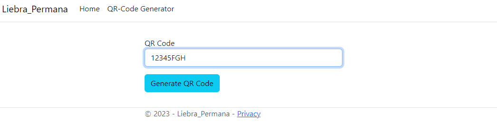

# Liebra Permana QR Code

## How to use
- Configuration Database

Edit file `appsettings.json`

`"DefaultConnection": "Data Source=.;Initial Catalog=LIEBRA_TEST;User Id=sa;password=12345;Integrated Security=False;MultipleActiveResultSets=True"`

- Update Database

 Open Package Manager Console

 run code `PM> Update-Database -context Liebra_Permana.Data.ApplicationDbContext`

 ## Documentation

  
